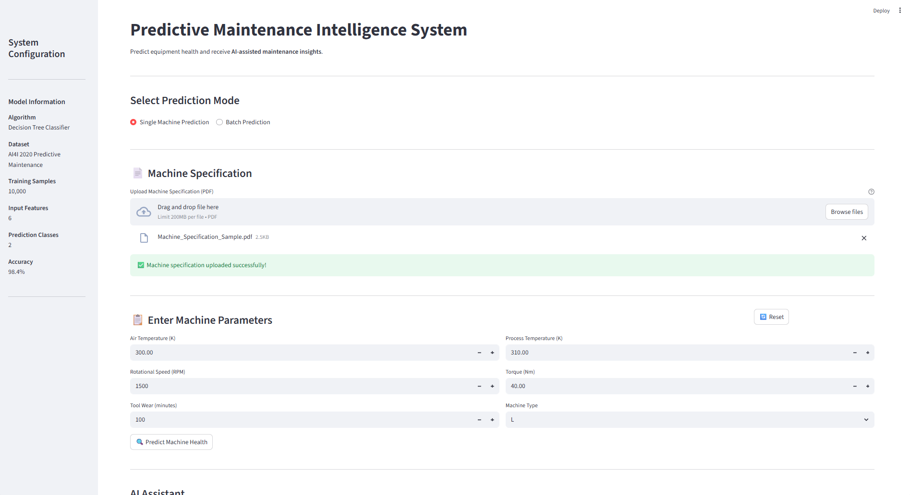
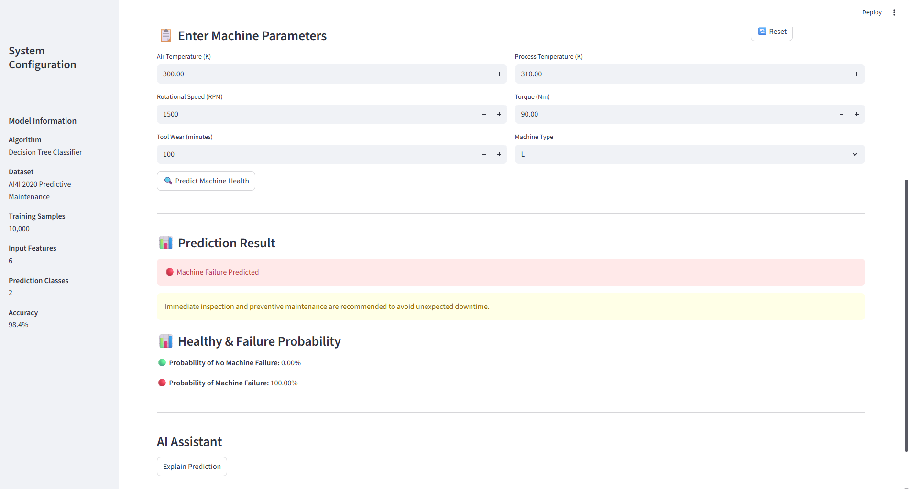
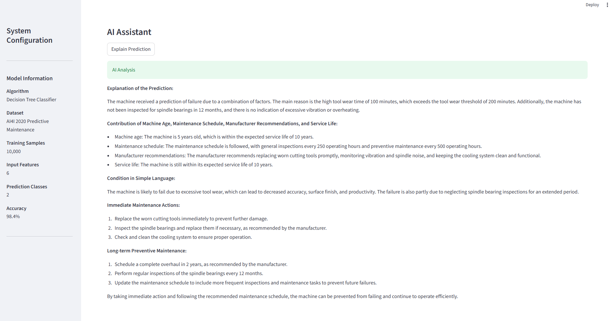
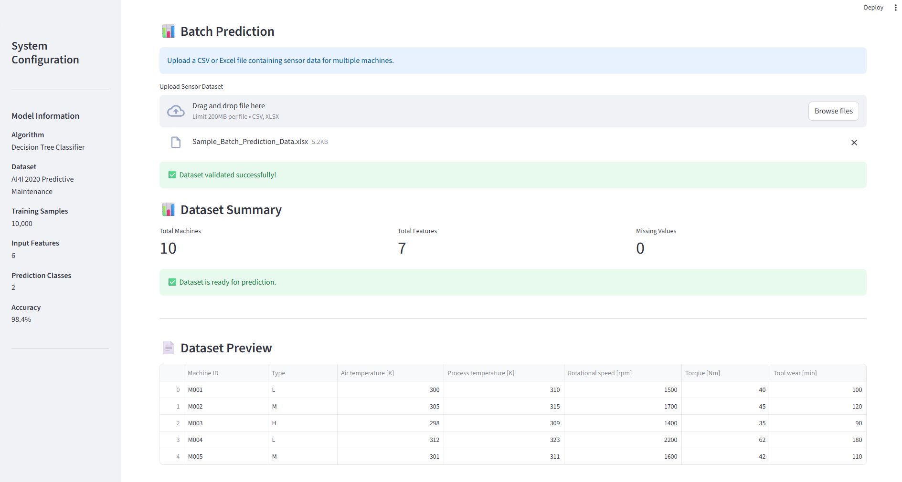
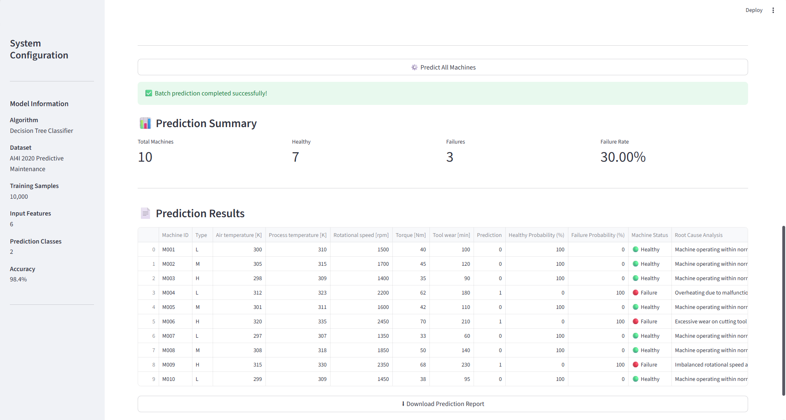

# 🏭 Predictive Maintenance Intelligence System

## 📖 Project Overview

**Predictive Maintenance Intelligence System** is an end-to-end machine learning application designed to predict industrial machine failures before they occur.

The system uses a trained **Decision Tree Classifier** to analyze machine operating parameters and predict machine health along with failure probabilities.

To make the predictions more useful for maintenance decisions, the application integrates **Llama 3.2 through Ollama** for AI-assisted explanations, root cause analysis, and maintenance recommendations.

The system supports both **single-machine prediction** and **batch machine prediction**, along with machine specification PDF processing and downloadable Excel prediction reports.

---

## 📸 Application Preview

### 🏠 Single Machine Prediction



---

### 📊 Machine Health Prediction



---

### 🤖 AI-Assisted Maintenance Analysis



---

### 📋 Batch Prediction & Failure Analysis



---

### 📥 Downloadable Prediction Report



---

## ✨ Features

- 🔍 **Single Machine Prediction** using real operating parameters
- 📊 **Batch Prediction** for multiple machines using CSV or Excel files
- 📈 **Prediction Probabilities** for healthy and failure conditions
- 🤖 **AI Prediction Explanation** using Llama 3.2
- 🧠 **AI Root Cause Analysis** for predicted failed machines
- 🔧 **Maintenance Recommendations** for failed machines
- 📄 **PDF Machine Specification Extraction** using `pdfplumber`
- 📋 **Dataset Validation and Summary**
- 📥 **Excel Prediction Report Download**
- 🔄 **Reset functionality** for new predictions
- 🖥️ **Interactive Streamlit Web Application**
- 🔒 **Local AI inference** using Ollama

---

## 🛠️ Tech Stack

- Python
- Pandas
- NumPy
- Scikit-learn
- Joblib
- Streamlit
- Ollama
- Llama 3.2
- pdfplumber
- OpenPyXL 

---

## 🏗️ System Architecture

The system follows a modular architecture combining machine learning,
document processing, and local AI assistance.

```text
                         USER
                           │
                           ▼
                ┌────────────────────┐
                │   STREAMLIT APP    │
                │       app.py       │
                └─────────┬──────────┘
                          │
              ┌───────────┴───────────┐
              │                       │
              ▼                       ▼
      SINGLE MACHINE           BATCH PREDICTION
      PARAMETERS               CSV / Excel
              │                       │
              │                       ▼
              │                  VALIDATION
              │                       │
              └───────────┬───────────┘
                          ▼
                 ┌─────────────────┐
                 │ DECISION TREE   │
                 │ CLASSIFIER      │
                 └────────┬────────┘
                          │
                          ▼
                 ┌─────────────────┐
                 │ MACHINE HEALTH  │
                 │   PREDICTION    │
                 │ Healthy/Failure │
                 │ Probabilities   │
                 └────────┬────────┘
                          │
             ┌────────────┴─────────────┐
             │                          │
             ▼                          ▼
      PDF SPECIFICATION           FAILED MACHINES  __________   HEALTHY MACHINES
      Single Prediction           Batch Prediction              Standard recommendations
             │                          │
             ▼                          │
       pdfplumber                       │
             │                          │
             └──────────┬───────────────┘
                        ▼
                 ┌──────────────┐
                 │ AI ASSISTANT │
                 │ Llama 3.2    │
                 │ Ollama       │
                 └──────┬───────┘
                        │
                        ▼
             Maintenance Insights
                        │
              ┌─────────┴─────────┐
              │                   │
              ▼                   ▼
       AI Explanation      Root Cause Analysis
                           + Maintenance Actions
                                   │
                                   ▼
                            Excel Report
```

## 🧠 Machine Learning Pipeline

```text
Machine Sensor Data
        ↓
Data Preprocessing
        ↓
Feature Scaling
        ↓
Decision Tree Classifier
        ↓
Machine Health Prediction
        ↓
Healthy / Failure Probability
        ↓
AI-Assisted Maintenance Analysis
```
---

## 📊 Input Features

The model uses:

- Machine Type
- Air Temperature (K)
- Process Temperature (K)
- Rotational Speed (RPM)
- Torque (Nm)
- Tool Wear (minutes)

---

## 📈 Model Output

The system predicts:

- 🟢 No Machine Failure
- 🔴 Machine Failure Predicted

It also calculates:

- Healthy Probability
- Failure Probability

---

## 🤖 AI Assistant

The application uses **Llama 3.2 through Ollama** for local AI-powered maintenance analysis.

### Single Machine Analysis

The AI assistant receives:

- Machine operating parameters
- ML prediction
- Prediction probabilities
- Machine specification information extracted from PDF

It generates:

- Explanation of the prediction
- Possible contributing factors
- Immediate maintenance actions
- Long-term preventive maintenance recommendations

### Batch Machine Analysis

For machines predicted as failures, the AI assistant generates:

- **Root Cause Analysis**
- **Recommended Maintenance Action**

---

## 📄 PDF Specification Processing

Machine specification documents can be uploaded as PDF files.

The application extracts their text using pdfplumber and provides the extracted information to the AI assistant for contextual maintenance analysis.

```text
Machine Specification PDF
          ↓
      pdfplumber
          ↓
   Extracted Text
          ↓
    AI Assistant
          ↓
Context-Aware Recommendation
```
---

### 📊 Batch Prediction

The batch prediction module supports:

.csv
.xlsx

Before prediction, the application validates the required columns and displays:

Total Machines
Total Features
Missing Values
Dataset Preview

After prediction, the system provides:

Total Machines
Healthy Machines
Failed Machines
Failure Rate
Prediction probabilities
Root Cause Analysis
Maintenance Recommendations

The complete prediction results can be downloaded as an Excel report.

--- 

## 📂 Project Structure

```text
predictive-maintenance-ml/
│
├── app.py
├── predictor.py
├── ai_assistant.py
├── batch_ai.py
├── pdf_reader.py
│
├── requirements.txt
├── README.md
├── .gitignore
│
├── data/
│   └── raw/
│       └── predictive_maintenance.csv
│
├── models/
│   ├── decision_tree_model.pkl
│   └── scaler.pkl
│
├── notebooks/
│   └── predictive_maintenance_ml.ipynb
│
└── images/
    ├── home.png
    ├── prediction.png
    ├── ai_assistant.png
    ├── batch_prediction.png
    └── prediction_report.png
    
---

## Module Responsibility

| File              | Responsibility                                               |
| ----------------- | ------------------------------------------------------------ |
| `app.py`          | Streamlit application and user interface                     |
| `predictor.py`    | Model loading, preprocessing, prediction and batch inference |
| `ai_assistant.py` | Single-machine AI explanation                                |
| `batch_ai.py`     | Failed-machine root cause analysis                           |
| `pdf_reader.py`   | Machine specification PDF text extraction                    |
| `models/`         | Trained Decision Tree and fitted scaler                      |

---

## 🚀 Installation

Clone the repository:

```bash
git clone <repository-url>
```

Move into the project folder:

```bash
cd predictive-maintenance-ml
```

Install the required packages:

```bash
pip install -r requirements.txt
```

Install and start Ollama, then download the required model:

```bash
ollama pull llama3.2
```

Run the application:

```bash
streamlit run app.py
```
---

## 🖥️ Application Workflow

### Single Machine:

Enter Machine Parameters
        ↓
Predict Machine Health
        ↓
View Prediction & Probability
        ↓
Upload Machine Specification
        ↓
Generate AI Explanation

### Batch Machines:

Upload CSV / Excel
        ↓
Validate Dataset
        ↓
Predict All Machines
        ↓
Identify Failed Machines
        ↓
AI Root Cause Analysis
        ↓
Maintenance Recommendations
        ↓
Download Excel Report

---

## 📈 Example Use Case

A maintenance engineer can enter or upload machine sensor data and immediately receive:

Machine Prediction
        ↓
Failure Probability
        ↓
AI Explanation
        ↓
Root Cause Analysis
        ↓
Maintenance Recommendation

For multiple machines, the system can process the entire dataset and generate an Excel prediction report containing machine status, probabilities, failure analysis, and maintenance recommendations.

---

## 🔮 Future Improvements

- Prediction history and monitoring
- Multiple model comparison
- Remaining Useful Life (RUL) prediction
- Automated maintenance scheduling
- Maintenance history integration
- Model monitoring and retraining pipeline

---

## 📄 License

This project is intended for educational and portfolio purposes.

---